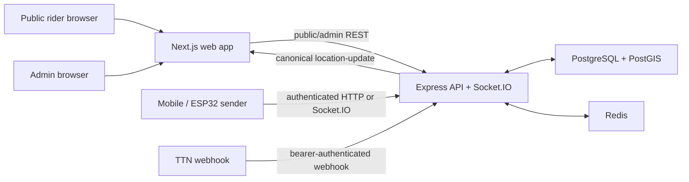

# Architecture

## System shape

The repository has two frontend experiences: the public tracker at `/` and the authenticated Admin
application under `/admin/*`. The backend exposes public, admin, sender-trip, HTTP-ingestion, and
TTN-webhook REST boundaries, plus Socket.IO for viewers and senders.

## Canonical live-state flow

1. A sender authenticates and, where applicable, starts a trip.
2. An HTTP, Socket.IO, or TTN adapter validates its boundary and passes the observation to the
   tracking service.
3. The service validates the source, coordinates, assigned vehicle, sender context, and optional
   trip ownership.
4. Redis stores the latest source snapshot. The service selects the first active fresh source for
   the vehicle by priority (with source ID as a deterministic tie-breaker).
5. The chosen canonical state is stored in Redis, broadcast as `location-update`, and sampled to
   PostGIS-backed history at a bounded rate.
6. Public and Admin maps consume the canonical projection, not arbitrary source observations.

Key invariants:

- One backend selection rule owns canonical vehicle truth. Transport adapters must not invent their
  own public payload or bypass the validation/selection boundary.
- `live`, `stale`, `no_service`, and `unknown` must retain their truthful semantics. A last-known
  position is not a current location and must not drive ETA.
- A failure to persist sampled history must not be represented as a failure to publish live state,
  and live-state success must not become a claim of durable research evidence.

## Authority boundaries

| Boundary | Rule |
|---|---|
| Public | Reads safe route/stop/live-state data and submits bounded feedback; no credentials, raw source metadata, or protected history. |
| Admin | JWT/session authentication is necessary but server-side current-role authorization remains authoritative. |
| Sender | Short-lived sender credentials are source/vehicle bound and revalidated for writes. |
| TTN | Webhook bearer secret and registered LoRaWAN source type are required before ingestion. |
| Research | Protected reads/exports must keep raw observations and uncertainty separate from operational/public DTOs. |

## Persistent and transient state

- **PostgreSQL/PostGIS:** users, routes, stops, vehicles, trips, feedback, tracking-source
  registrations, sampled canonical history, and research records.
- **Redis:** public-data cache, latest source snapshot, current canonical vehicle state, bounded
  counters/throttles, and the Socket.IO adapter.
- **Frontend:** presentation and connection state only; it does not define canonical service truth.

## Engineering constraints

- Keep API/schema changes backward-aware and test the authorization, failure, and state-transition
  paths they affect.
- Validate untrusted input at the server boundary and avoid logging credentials, request payloads,
  raw coordinates, hashes, or secret/configuration values.
- A migration file and local/static validation are not rollout evidence. Target history, backup,
  upgrade/rollback, and live state require explicitly authorized target evidence.
- Production topology and operator requirements are documented in
  [deployment.md](deployment.md) and [operations/university-server-network-handoff.md](operations/university-server-network-handoff.md).
