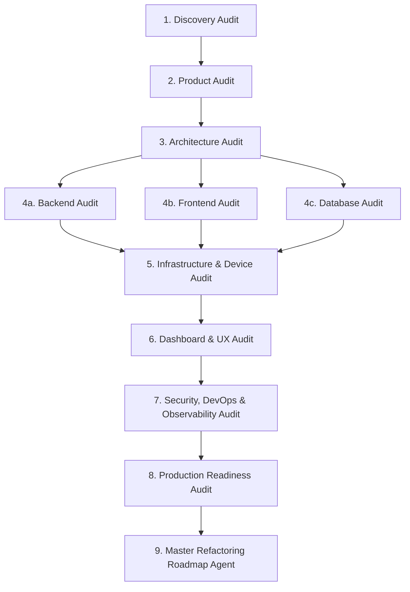

# Lead Audit Coordinator Skill

## Overview
This skill governs the execution, orchestration, sequencing, change proposals, and decision-queue management for the Lead Audit Agent (`agents/lead-audit/AGENT.md`) in the Tram Tracking System.

---

## 1. Operating Modes & Triggers

| Mode | Trigger | Action & Required Outcome |
|---|---|---|
| **Status** | User requests status/outdated state | Inspect evidence; report current, missing, outdated, or blocked audit phases. |
| **Plan** | User requests re-audit planning | Detect changes, select agents, propose execution order and decision gates; await approval. |
| **Run Next** | Default execution request | Validate prerequisites, execute exactly ONE next domain audit phase, then stop. |
| **Run Specific** | User names a specific domain agent | Validate inputs, run only that specific domain phase, record decisions, then stop. |
| **Run All Approved** | User explicitly approves all phases | Execute in strict dependency order; stop if missing evidence or decision gate is hit. |

---

## 2. Canonical Audit Execution Sequence
Execute Level 1 domain audits in this strict dependency order:

---

## 3. Shared Audit State Management
Only the Lead Audit Coordinator updates project-level audit records upon validating domain reports:
1. `docs/audits/README.md`: Update phase status (`Pending`, `In Progress`, `Complete`, `Needs Re-audit`, `Blocked`).
2. `docs/audits/lead-audit-summary.md`: Synthesize overall progress, validated findings, remaining risks, and next steps.
3. `docs/decision-queue.md`: Record new material choices requiring Project Owner approval.
4. `docs/agent-change-queue.md`: Log proposed or applied changes to agent instructions.

---

## 4. Agent Change Queue Protocol (`docs/agent-change-queue.md`)
Before modifying any Level 1 or Level 2 agent instruction file:
- File a proposal in `docs/agent-change-queue.md` with: ID (`AC-xxx`), Agent File, Problem/Evidence, Proposed Change, Expected Benefit, Audit-Blocking Status, Owner Decision, and Date.
- Never modify an agent instruction file directly without an approved change proposal.
